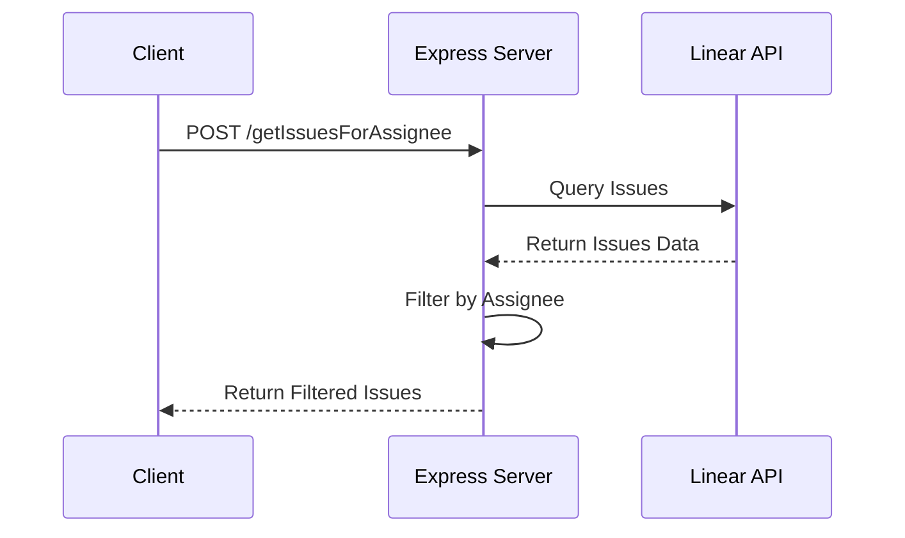
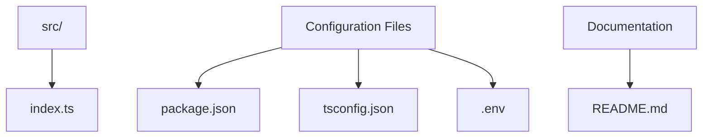

## Copilot-Lienar-App-SkillSet

This is copilot extension skillset example that connects with Linear App via API. You can read the step by step blog on this on Medium here : https://medium.com/@tajinder.singh1985/github-copilot-extensions-query-your-sprint-backlog-from-linear-within-your-ide-c703259db0c1

## Linear API Integration

A Node.js application that integrates with Linear's API to fetch and filter issues by assignee.

## Features

- REST API endpoint to fetch Linear issues
- Filter issues by assignee name
- Returns detailed issue information including status and timestamps

## Prerequisites

- Node.js (>= 14.x)
- npm or yarn
- Linear API Key

## Setup

1. Clone the repository
```bash
git clone <repository-url>
cd copilot-skillset-example
```

2. Install dependencies
```bash
npm install
```

3. Configure environment variables
- Copy `.env.example` to `.env`
- Add your Linear API key:
```
LINEAR_API_KEY=your_api_key_here
```

## Running the Application

Development mode with hot-reload:
```bash
npm run dev
```

Production build:
```bash
npm run build
npm start
```

## API Endpoints

### Get Issues by Assignee
- **Endpoint:** POST `/getIssuesForAssignee`
- **Body:**
```json
{
    "assigneename": "John Doe"
}
```
- **Response:**
```json
{
    "total": 1,
    "issues": [
        {
            "id": "ISS-123",
            "title": "Issue Title",
            "description": "Issue Description",
            "status": "In Progress",
            "assignee": "John Doe",
            "createdAt": "2024-02-20T12:00:00Z"
        }
    ]
}
```

## Architecture



## Project Structure



## Error Handling

The API implements the following error responses:

- 400: Bad Request (Missing assignee name)
- 500: Internal Server Error (API or server issues)

## Development

To contribute to the project:

1. Create a new branch
2. Make your changes
3. Submit a pull request

## License

This project is licensed under the MIT License.
